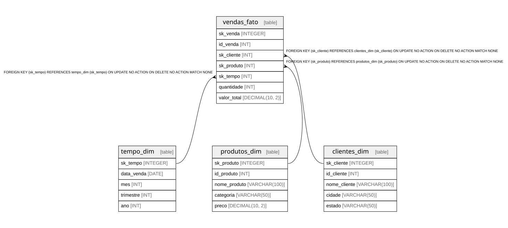

1. Desenhar o diagrama do Star Schema com base nas tabelas relacionais de produtos, clientes e vendas.

2. Implementar as consultas de carga e agregação para gerar três visões analíticas distintas (ex.: Vendas por Estado, Vendas por Categoria e Faturamento por Período). 

# Preparar ambiente

1. Iniciar banco (WSL/Git Bash instalados): executar `prepare.sh`

2. Tenha o sqlite3 e uv instalado. [instalar uv aqui](https://docs.astral.sh/uv/getting-started/installation/)

3. Inicializar projeto: `uv sync`, `uv pip install -e .`

# Executar ETL

- `uv run src/create_olap.py`

# Desenvolvimento

- Testagem com `./prepare.sh && uv run pytest`
