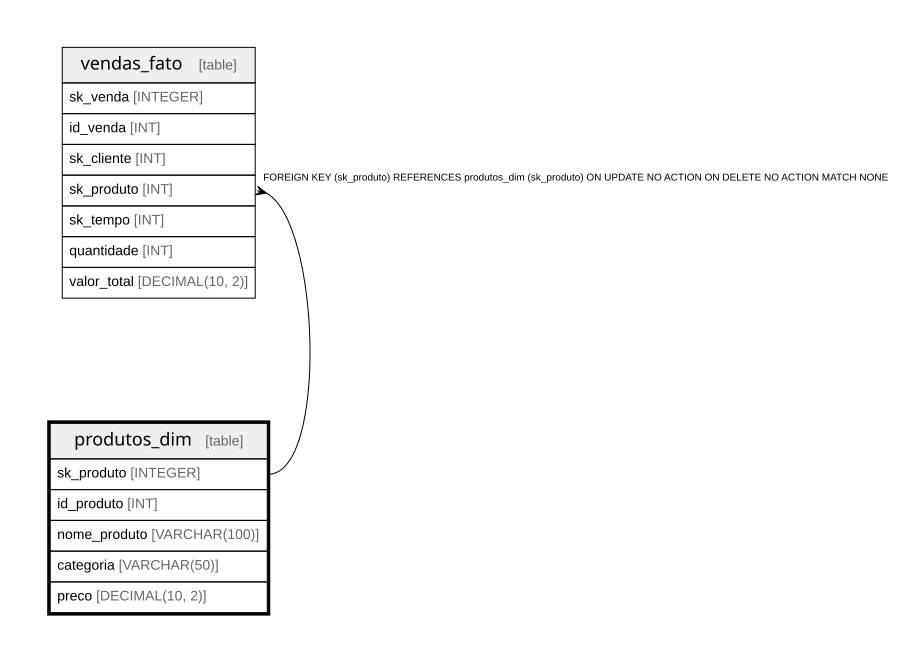

# produtos_dim

## Description

<details>
<summary><strong>Table Definition</strong></summary>

```sql
CREATE TABLE produtos_dim (
	sk_produto INTEGER PRIMARY KEY AUTOINCREMENT,
	id_produto INT NOT NULL,
    nome_produto VARCHAR(100) NOT NULL,
    categoria VARCHAR(50),
    preco DECIMAL(10, 2) NOT NULL
)
```

</details>

## Columns

| Name | Type | Default | Nullable | Children | Parents | Comment |
| ---- | ---- | ------- | -------- | -------- | ------- | ------- |
| sk_produto | INTEGER |  | true | [vendas_fato](vendas_fato.md) |  |  |
| id_produto | INT |  | false |  |  |  |
| nome_produto | VARCHAR(100) |  | false |  |  |  |
| categoria | VARCHAR(50) |  | true |  |  |  |
| preco | DECIMAL(10, 2) |  | false |  |  |  |

## Constraints

| Name | Type | Definition |
| ---- | ---- | ---------- |
| sk_produto | PRIMARY KEY | PRIMARY KEY (sk_produto) |

## Relations



---

> Generated by [tbls](https://github.com/k1LoW/tbls)
