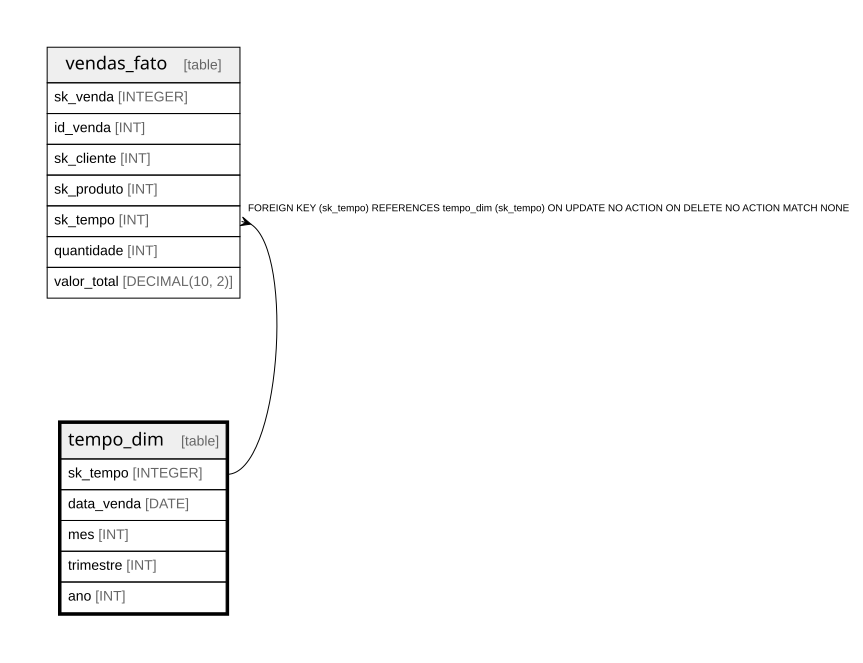

# tempo_dim

## Description

<details>
<summary><strong>Table Definition</strong></summary>

```sql
CREATE TABLE tempo_dim (
	sk_tempo INTEGER PRIMARY KEY AUTOINCREMENT,
	data_venda DATE NOT NULL,
	mes INT NOT NULL,
	trimestre INT NOT NULL,
	ano INT NOT NULL
)
```

</details>

## Columns

| Name | Type | Default | Nullable | Children | Parents | Comment |
| ---- | ---- | ------- | -------- | -------- | ------- | ------- |
| sk_tempo | INTEGER |  | true | [vendas_fato](vendas_fato.md) |  |  |
| data_venda | DATE |  | false |  |  |  |
| mes | INT |  | false |  |  |  |
| trimestre | INT |  | false |  |  |  |
| ano | INT |  | false |  |  |  |

## Constraints

| Name | Type | Definition |
| ---- | ---- | ---------- |
| sk_tempo | PRIMARY KEY | PRIMARY KEY (sk_tempo) |

## Relations



---

> Generated by [tbls](https://github.com/k1LoW/tbls)
