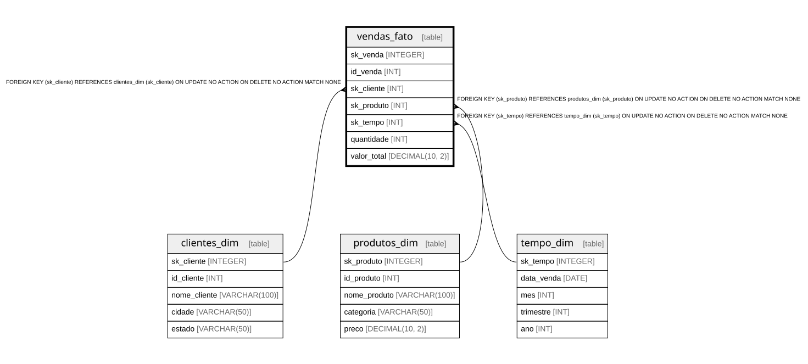

# vendas_fato

## Description

<details>
<summary><strong>Table Definition</strong></summary>

```sql
CREATE TABLE vendas_fato (
	sk_venda INTEGER PRIMARY KEY AUTOINCREMENT,
	id_venda INT NOT NULL,

    sk_cliente INT NOT NULL,
    sk_produto INT NOT NULL,
	sk_tempo INT NOT NULL,

    quantidade INT NOT NULL,
    valor_total DECIMAL(10, 2) NOT NULL,

    FOREIGN KEY (sk_cliente) REFERENCES clientes_dim(sk_cliente),
    FOREIGN KEY (sk_produto) REFERENCES produtos_dim(sk_produto)
	FOREIGN KEY(sk_tempo) REFERENCES tempo_dim(sk_tempo)
)
```

</details>

## Columns

| Name | Type | Default | Nullable | Children | Parents | Comment |
| ---- | ---- | ------- | -------- | -------- | ------- | ------- |
| sk_venda | INTEGER |  | true |  |  |  |
| id_venda | INT |  | false |  |  |  |
| sk_cliente | INT |  | false |  | [clientes_dim](clientes_dim.md) |  |
| sk_produto | INT |  | false |  | [produtos_dim](produtos_dim.md) |  |
| sk_tempo | INT |  | false |  | [tempo_dim](tempo_dim.md) |  |
| quantidade | INT |  | false |  |  |  |
| valor_total | DECIMAL(10, 2) |  | false |  |  |  |

## Constraints

| Name | Type | Definition |
| ---- | ---- | ---------- |
| sk_venda | PRIMARY KEY | PRIMARY KEY (sk_venda) |
| - (Foreign key ID: 0) | FOREIGN KEY | FOREIGN KEY (sk_tempo) REFERENCES tempo_dim (sk_tempo) ON UPDATE NO ACTION ON DELETE NO ACTION MATCH NONE |
| - (Foreign key ID: 1) | FOREIGN KEY | FOREIGN KEY (sk_produto) REFERENCES produtos_dim (sk_produto) ON UPDATE NO ACTION ON DELETE NO ACTION MATCH NONE |
| - (Foreign key ID: 2) | FOREIGN KEY | FOREIGN KEY (sk_cliente) REFERENCES clientes_dim (sk_cliente) ON UPDATE NO ACTION ON DELETE NO ACTION MATCH NONE |

## Relations



---

> Generated by [tbls](https://github.com/k1LoW/tbls)
